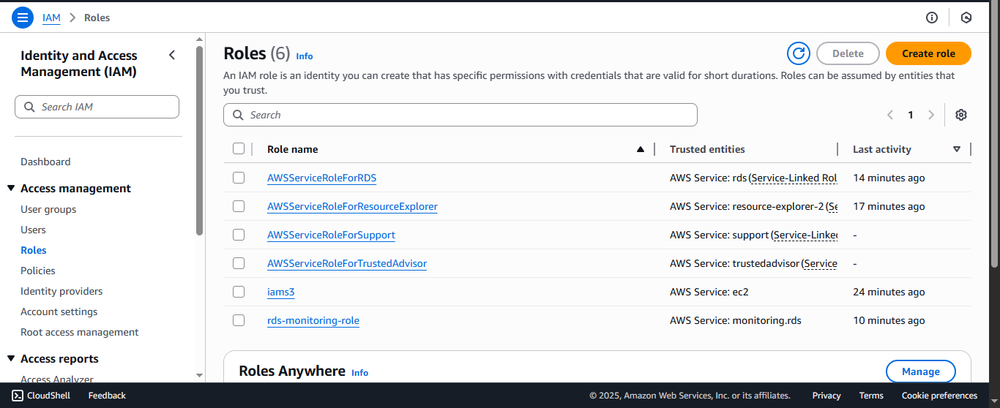
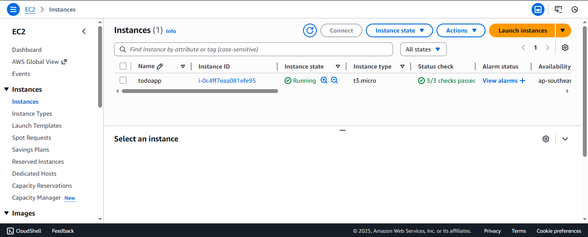
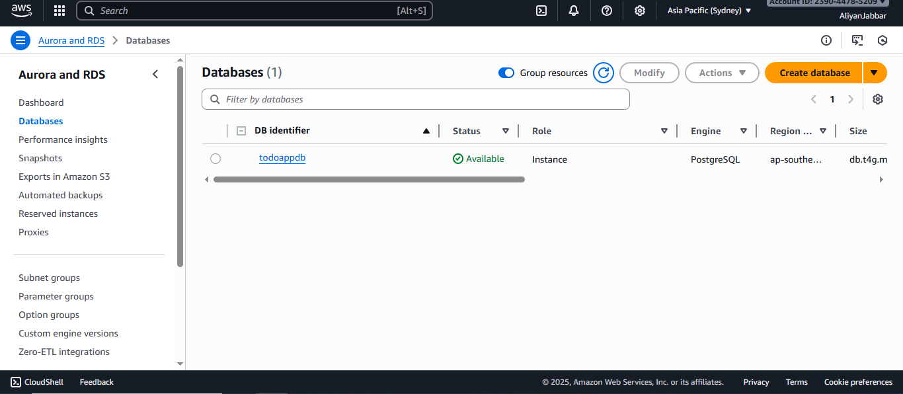
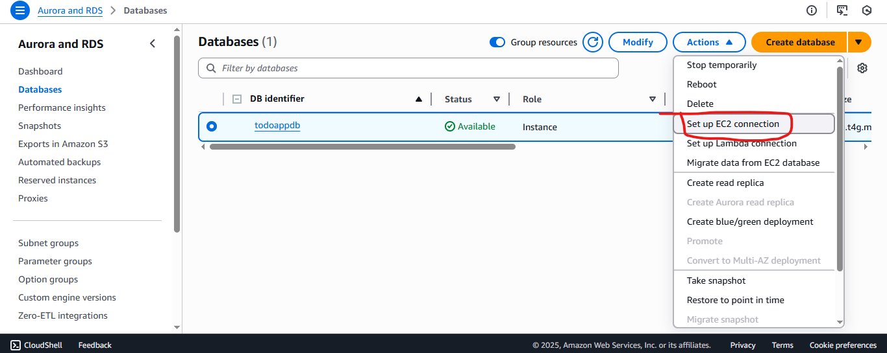
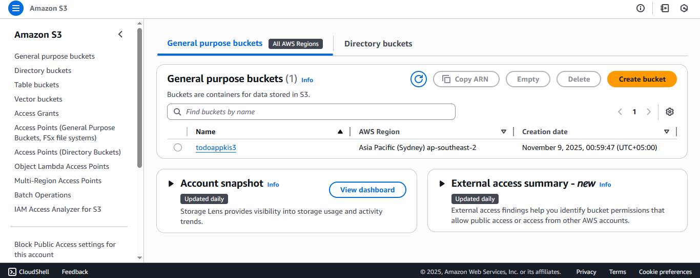
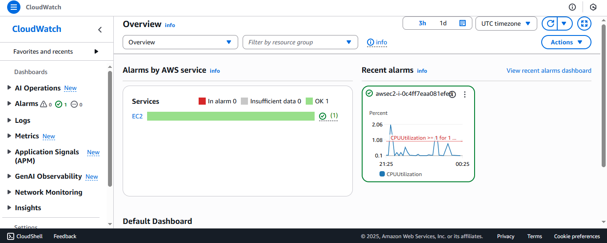
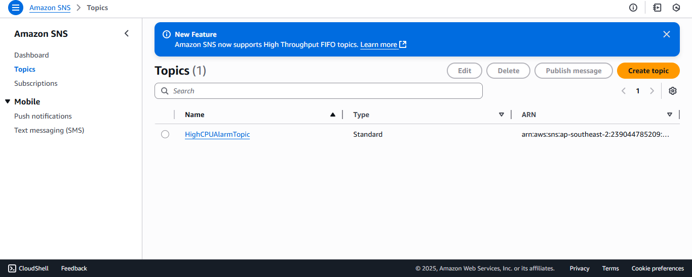
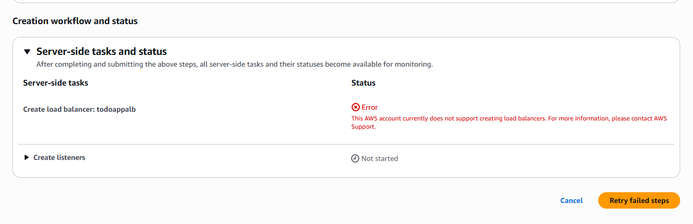

# 🚀 AWS Todo App Deployment

I built and deployed a **Todo App** on an **AWS EC2 instance**, connected to a **PostgreSQL RDS database**, and integrated **S3 logging**, **CloudWatch monitoring**, and **SNS notifications** for complete observability and automation.

---

## 🧠 Overview

This project demonstrates my experience with AWS cloud infrastructure — provisioning EC2, RDS, and IAM roles, connecting a FastAPI backend to the database, setting up logging to S3, and configuring CloudWatch alarms with SNS notifications.

---

## ⚙️ Infrastructure & Configuration

### 🔐 IAM Role Setup
I created an IAM role named `EC2-TodoApp-Role` with the following permissions:
- **AmazonS3FullAccess** (for automated log uploads)
- **AmazonRDSFullAccess** (to interact with PostgreSQL RDS)

This IAM role allows the EC2 instance to securely push logs to S3 **without storing credentials** in the codebase.



---

### 💻 EC2 Instance Configuration
I launched an **Ubuntu EC2 instance**, assigned the IAM role, and configured security groups to allow:
- **SSH (22)** for remote access  
- **HTTP (80)** for web access  
- **Custom TCP (8000)** for FastAPI  

The instance hosts the FastAPI backend that powers the Todo App.



---

### 🗄️ RDS PostgreSQL Database
I set up an **Amazon RDS PostgreSQL instance** and configured it to be accessible from my EC2 instance by linking their security groups.  
All environment variables for DB credentials and host were securely managed.



---

### 🔗 EC2 ↔ RDS Connection
The app communicates with the PostgreSQL RDS instance using the RDS endpoint, database name, username, and password.  
Connection testing was done directly from EC2 using the PostgreSQL client.



---

## 🧩 Backend Setup on EC2

Once the infrastructure was ready, I configured the environment and deployed the FastAPI app.

```bash
sudo apt update
sudo apt install postgresql-client -y
curl -LsSf https://astral.sh/uv/install.sh | sh
git clone <your-repo-url>
cd todo_aws
uv venv
uv add "fastapi[standard]"
fastapi dev main.py --host 0.0.0.0
```

The app was successfully accessible at:

```
http://<my-ec2-public-ip>:8000
```

---

## ☁️ AWS S3 Integration for Logs

I configured automatic log uploads from EC2 to **Amazon S3** every 10 seconds.  
All logs are stored under the bucket `todoappkis3` inside the `/logs` directory.

Example log files:
```
logs/app_log_2025-11-09_16-50-10.log
logs/app_log_2025-11-09_16-50-20.log
```

Manual log uploads can also be triggered via:
```bash
curl -X POST http://<my-ec2-public-ip>:8000/upload-logs
```

or using AWS CLI:
```bash
aws s3 cp app.log s3://todoappkis3/logs/app_log_$(date +%Y-%m-%d_%H-%M-%S).log
```

> Thanks to the attached IAM Role, no manual AWS credentials were required.



---

## 📊 CloudWatch Monitoring

I configured **CloudWatch alarms** to monitor the EC2 instance’s **CPU utilization**.  
Whenever CPU usage exceeds **0.99%** over a 5-minute period, CloudWatch automatically triggers notifications through **SNS**.



---

## 📣 SNS Notification Service

To ensure real-time alerts, I integrated **Amazon SNS (Simple Notification Service)** with CloudWatch alarms.

- Created an **SNS Topic** named `TodoAppAlerts`.
- Subscribed my **email address** to the topic to receive alerts.
- Linked the topic with the CloudWatch CPUUtilization alarm.

Now, whenever the CPU usage crosses the defined threshold, I receive an instant email notification about the alert.



---

## ⚡ Load Balancer

I also experimented with setting up an **Application Load Balancer (ALB)** to distribute traffic to the EC2 instance — ideal for scaling beyond the free tier. But unfortunately I was unable to do this in free tier, giving me an error something like this



---

## 🧾 Key Highlights

- ✅ **FastAPI backend** deployed on AWS EC2  
- ✅ **RDS PostgreSQL** for data persistence  
- ✅ **S3 integration** for automated log storage  
- ✅ **CloudWatch + SNS** for proactive monitoring  
- ✅ **IAM Role-based authentication** (no credentials needed)  
- ✅ **Scalable setup with optional ALB support**

---

## 🧠 Learnings & Takeaways

Through this deployment, I gained practical experience in:
- Secure AWS IAM role configurations  
- Connecting distributed AWS services (EC2 ↔ RDS ↔ S3 ↔ CloudWatch ↔ SNS)  
- Automating server-side logging pipelines  
- Cloud infrastructure management and monitoring  
